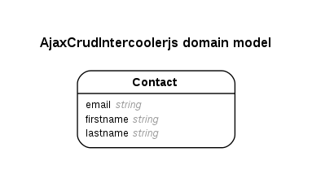

# Ruby on Rails Example Apps

## AJAX CRUD using intercooler.js (ajax-crud-intercoolerjs)
Converting a Rails CRUD UI into an AJAX UI using intercooler.js

---

## Versions
- ruby 2.2.1p85 (2015-02-26 revision 49769) [x86_64-linux]
- Rails 4.2.5

## Sublime Text Packages
- Terminal
- Sublime​Code​Intel
- Side​Bar​Git
- Git​Gutter
- Sublime​ERB