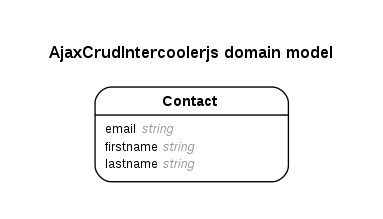

# AJAX CRUD using intercooler.js

## Source
http://intercoolerjs.org/tutorials/crud.html

## Outline
Here are the steps for converting a Rails CRUD UI into an AJAX UI

- Add a reference to the the IntercoolerJS library from the download page.
- Update the edit button to use the ic-get-from and ic-target attributes.
- Update the controller to not render layouts for intercooler requests by using the ic-request parameter.
- Update the save button to use the ic-put-to and ic-target attributes.
- Update the controller's update method to render partials correct.y
- Set the location of the browser using the X-IC-SetLocation header.
- Update the new and create UI and controller code in a similar manner.